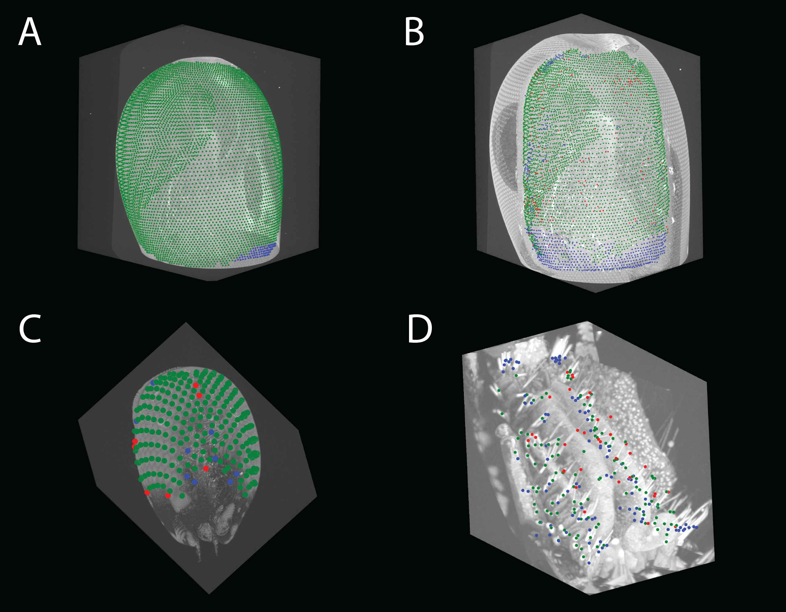

# DHR - Deep Heatmap Regression



Deep Heatmap Regression (DHR) uses deep learning to detect and localise points of interest in large 3D volumes (like CT or MRI scans). It works by training a convolutional neural network (U-Net) to generate heatmaps where peaks indicate the locations of features. Then, it can run on unseen scans and locate peaks in heatmaps to find precise 3D coordinates. This project forms part of Jake Manger's PhD thesis at the University of Western Australia (2025).

This project is set up to automatically localise one category of points in large 3D volumes,
but can be extended for other applications. Please [create an issue](https://github.com/jakemanger/dhr/issues/new) if you are facing issues and [submit a pull request](https://github.com/jakemanger/dhr/pulls) if you would like to contribute!


## Setup

1. Clone this repository from github

2. Install Python 3.9 (sometimes called `py` in the below command on Windows) and make a Python virtual environment in the root directory (if not already present).
```bash
python3.9 -m venv venv
```
See [here](https://towardsdatascience.com/getting-started-with-python-virtual-environments-252a6bd2240)
for more information on virtual environments.

3. Activate the python virtual environment.
(On Linux/macOS)
```bash
source venv/bin/activate
```

(On Windows)
```
venv\Scripts\activate
```

4. Install dependencies
```bash
pip install -r requirements.txt
```

5. Set up symlinks

To quickly set up symbolic links for your dataset, logs, and output folders, use the provided script:

```bash
bash scripts/setup_symlinks.sh
```

The script will prompt you for the full paths to your dataset, logs, and output directories, then create symbolic links named `dataset`, `logs`, and `output` in your current directory. This makes it easy to standardise folder access across environments as these can be huge and be stored on hard drives etc.

- If a symlink or folder already exists, you'll be prompted before it is replaced.
- After running, you can use `./dataset`, `./logs`, and `./output` in your project.


## Quick Start (for Linux)

#### 1. Activate the Python virtual environment
```bash
source venv/bin/activate
```

### Prepare Your Dataset
#### 2. Generate CSV files with training data
Generate a CSV file with 3 columns (x, y and z axes) with the location of the labels you wish to detect.

Note: If you have labelled your volumes in MATLAB using the MCTV program, see [mctv_to_csv.md](./docs/mctv_to_csv.md) to generate your label files and update your data source specifier csv file.

#### 3. Generate CSV to control the data generation
Add the files you want to use for images and labels to a data source specifier csv file with 3 columns:
- `image_file_path` (path to the dicom or nifti file used to annotate with mctv)
- `split` (containing 'train' or 'test' to say how the data should be split)
	This should be generated randomly, or rerun multiple times as part of a
	k-fold cross validation process.
- `labels_<YOUR_LABEL_NAME>` a path to a 3 column csv file (x, y and z axes) with the location of the labels you wish to detect.
    Add additional `labels_<YOUR_ADDITIONAL_LABEL_NAME>` columns if you wish to use these columns for defining
    a cropping area.

Example: `data_source_specifiers/fiddlercrab_corneas.csv`

Which should provide a CSV file like the following (order doesn't matter). You can also have additional columns in there to help you comment on the data/process. They will be ignored

| image_file_path | split | labels_corneas |
|-----------------|-------|----------------|
| /path/to/image1 | train | /path/to/cornea_labels1.csv |
| /path/to/image2 | test  | /path/to/cornea_labels2.csv |
| /path/to/image3 | train | /path/to/cornea_labels3.csv |


This file should be placed in the `./data_source_specifiers` directory.


#### 4. Generate dataset
Generate the dataset (if not already found in the `./dataset/` directory) using the data source specifier csv file from step 2.
```bash
python generate_dataset.py ./data_source_specifiers/fiddlercrab_corneas.csv -l corneas -v 10 -cl corneas
```
*The `generate_dataset.py` command used above will have generated patches and whole volumes for inference using a resolution that has on average 10 voxels between each feature of interest. You can edit the previous command if you want different resolutions by adding arguments after the `-v` flag.*


#### 5. Create config file
Create a new config file in the configs directory. You should create a new one of these for each of your tasks. You can base these on one of the examples: e.g. the `configs/fiddlercrab_corneas.yaml` file. Alter the parameters to what you think are suitable

Change the `label_suffix` parameter in your config file to the name of the label that you want to detect. E.g. 'corneas' or 'rhabdoms'.

Add the path to the dataset folders generated in step 3. You should update the `train_images_dir`, `train_labels_dir`, `test_images_dir` and `test_labels_dir` parameters.
E.g.
```
train_labels_dir: ./dataset/fiddlercrab_corneas/cropped/train_images_10
```


#### 6. Final check
Check whether the voxel spacing, patch size (if you are using patches) and heatmap parameters look suitable by inspecting plots generated by the following command (replacing `YOUR_CONFIG_FILE` with the name of your newly created config file):

```bash
python check_data.py ./configs/YOUR_CONFIG_FILE.yaml
```


If you want to go though and check each image, this will plot each image and label in the dataset. This is useful for checking that the labels are oriented correctly and assigned to the right scan/image.

If the parameters are not suitable, see the [Heatmap Parameter Tuning Guide](./docs/heatmap_tuning.md) for detailed instructions on adjusting:
- Voxel spacing
- `starting_sigma`, `peak_min_val`, and `correct_prediction_distance`
- Choosing between patches or whole volumes
- Troubleshooting common issues

It's also good to ensure that all images and labels can be loaded without error:
```bash
python check_data.py ./configs/YOUR_CONFIG_FILE.yaml --check-loading
```


### Initial Training

*TIP: Run `python main.py -h` to view the help file for all available arguments and usage.*

Start training, specifying the path to your config file as an argument:
```bash
python main.py train configs/fiddlercrab_corneas.yaml
```

(To view live training progress charts, open a new terminal in this directory and start up TensorBoard)
```bash
source venv/bin/activate
tensorboard --logdir logs/fiddlercrab_corneas
```

Once you are happy with a model's performance, copy and paste its folder in the logs/YOUR_CONFIG_FILENAME/lightning_logs directory
(e.g. version_5) to the `zoo/` folder. This is so you can keep track of your models in a zoo, and easily
use them for running inference.

It's advisable that you change the `debug_plots` variable in your `config.yaml` file to `True` before running your full training length, so that you can verify whether your parameters to locate peaks are suitable. Pay particular attention to the `peak_min_val` variable. After you've verified everything looks OK, change `debug_plots` back to `False` and train your model!


### Train with Transfer Learning or Continue Training

(OPTIONAL) If you would like to start with a pre-trained model and refine it on a new dataset, you can use transfer learning. You can also use this to continue training a model from a previous checkpoint.
The training process is the same, except you must specify the `starting_weights_path` argument with the `--starting_weights_path` or `-w`
flag.
For example:
```bash
python main.py train configs/fiddlercrab_corneas.yaml -w zoo/fiddlercrab_corneas/version_2/checkpoints/epoch=44-step=391680.ckpt
```
*Warning: The config used to train the starting weights (found in the same directory as the checkpoints folder) must have a matching neural network architecture (e.g., number of layers and neurons) for this to work correctly. You should also start from a checkpoint with a specific epoch number to ensure that the model loaded every volume in the dataset each epoch (for correct reporting of results).*


### Optimise Hyperparameters

(OPTIONAL) If you are unhappy with your model's performance, it may be that the hyperparameters you are using are not well suited
to your problem.

You can either:

- Manually adjust these in the `config.yaml` file, and rerun the training steps above.

- Or, automatically optimise these parameters with a hyperparameter search:
```
python main.py tune configs/fiddlercrab_corneas.yaml
```
I have implemented what the search method in the `main.py` file and what hyperparameters to search for
in the `actions.py` file, under the `objective()` function. You can edit this function to change
what values you want to search for. See
https://optuna.readthedocs.io/en/stable/reference/generated/optuna.study.Study.html#optuna.study.Study.optimize for more info.

If your computer can run multiple instances of the hyperparameter search/tuning process, open more terminals and type
```
source venv/bin/activate
python main.py tune configs/fiddlercrab_corneas.yaml -s sqlite:///fiddlercrab_corneas_tuning.db
```
to run the job in a parallised way and make the search process faster.

(To view live training progress charts, open a new terminal in this directory and start up TensorBoard)
```bash
source venv/bin/activate
tensorboard --logdir ./logs --port 6006
```

Once you have found suitable hyperparameters, and as you find better hyperparameters, they will be printed to the console
and also saved with their performance in a sqlite database. You should take these best values and use them to update your `config.yaml` file.


### Inference

Once you have a trained model, you can use it to make predictions, otherwise known as inference.

To do so, you will first have to resample the test volume to have approximately the same number of voxels between the labels you are looking to detect as the images used for training.

#### Running on New Volumes

If you have a new volume, you first need to resample it.
You should resample it so the number of voxels between features is approximately the same as the images used for training. This is likely 10 voxels if you are following the above steps.

To estimate this, you can open a program like Dragonfly, 3DSlicer or ImageJ and measure the distance between the features you are looking to detect in the volume. You can then use this distance to estimate the number of voxels between each feature in the resampled volume.

Work out the resample ratio by dividing the distance between features by the number of voxels you want between each feature. This is your resample ratio.

Once you have this, you can resample the volume with the inference command.

```bash
python main.py infer configs/cystisoma_corneas.yaml -v /path/to/volume.nii -m .logs/cystisoma_corneas/lightning_logs/version_13/ -rr YOUR_RESAMPLE_RATIO
```

### Inference Example: Detecting Paraphronima Corneas

1. Start Jupyter with the `jupyter lab` or `jupyter notebook` command

2. Open `Infer_on_new_paraphronima.ipynb` in Jupyter

3. Change the `image_path = '/home/jake/projects/dhr/Cystisoma_sp_FEG221129_366_corneas_estimating_resample_ratio.csv'` line to be the file path of your file.

4. Run the first 3 blocks of code - Up until you run
```
# view file with napari
import napari


viewer = napari.view_image(image.numpy(), name='image')
```
Once you run this, your scan will open in Napari.

5. Click on a few neighbouring points of interest (e.g. 6). This is to get an estimate of the average distance between points of interest - so we can resample the scan to be similar to the training data.

To add a points layer, click the points button in the left menu and then click the + button and click on a few points of interest. Then make sure you select that layer in the left menu.

Then click File > Save Selected Layer and save it to the resampled_ratio_measurements/ directory. You should give it a good name as you will need the file name in the next step.


6. Continue following the instructions in the notebook and then you will get a calculated `resample_ratio` to plug into the command below like `-rr 2.315`

7. Edit the inference command code block with the file name the image you want to use and the model you are running inference with. e.g.

Then run it

```.
python main.py infer configs/paraphronima_corneas.yaml -v '/media/jake/Dropbox_mirror/Smithsonian Dropbox/Jan Hemmi/hyperiid scans/Scans_nifti/Paraphronima_crassipes_f536_u1701837_head/Paraphronima_crassipes_f536_u1701837_head.nii' -m ./logs/paraphronima_corneas/lightning_logs/version_13/ -rr 3.1768202046528278 -nx 3 -ny 3 -nz 3 --average_threshold 0.25 -ipmv 0.25
```

8. Copy the file paths into the next code block to plot them and see if the heatmap and points look correct. If not, adjust some parameters (e.g., `average_threshold` and `ipmv` - they range between 0 and 1, and lower values add more points while higher values add fewer points).

You will need to copy the resampled space points CSV path and the heatmap `.nii` file path.

That is, these lines:
```
Saving prediction to ./output/Paraphronima_crassipes_f536_u1701837_head.logs_paraphronima_corneas_lightning_logs_version_13_checkpoints_last_x_3_y_3_z_3_average_threshold_0.25_prediction.nii
Locating peaks...
Saving peaks in resampled space...
saving to output/Paraphronima_crassipes_f536_u1701837_head.logs_paraphronima_corneas_lightning_logs_version_13_checkpoints_last_x_3_y_3_z_3_average_threshold_0.25_prediction_peak_min_val_0_25_method_center_of_mass.resampled_space_peaks.csv
```

The "Peaks in original image space" will be the coordinates of located points in the original sizing of the scan.
```
Saving peaks in original image space...
saving to output/Paraphronima_crassipes_f536_u1701837_head.logs_paraphronima_corneas_lightning_logs_version_13_checkpoints_last_x_3_y_3_z_3_average_threshold_0.25_prediction_peak_min_val_0_25_method_center_of_mass.peaks.csv
```


#### Running on Test Data

If you ran step 3, these will have already been generated for you
in a folder called something like: `data/fiddler/whole/test_images/`

Then run the following command, specifying the paths to your config file, the volume you want to run inference on and your trained model.

```bash
python main.py infer configs/fiddlercrab_corneas.yaml -v ./dataset/fiddlercrab_corneas/whole/test_images_10/ -m ./zoo/fiddlercrab_corneas/version_4/
```

Outputs from your inference will be found in the `./output` directory.


## Running on HPC Clusters

For running DHR on the Smithsonian Institution High Performance Cluster (Hydra), see the [Hydra HPC Guide](./docs/hydra_hpc.md).