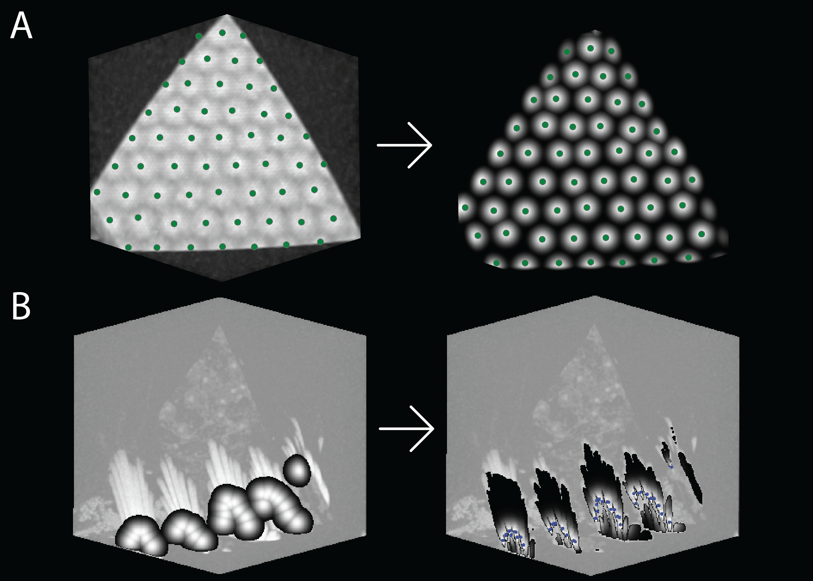

# Heatmap Parameter Tuning Guide


*Generation of ground truth heatmaps for model training. A) For symmetrical features, Gaussian distributions are placed at ground truth coordinates. B) For elongated features, a two-stage process is used: first generating larger Gaussian distributions (σ = 8) to accommodate positional variance along the structure, then masking these heatmaps using intensity values from the z-normalised input volume to restrict heatmap values to the feature of interest.*

This guide helps you optimize heatmap parameters for your deep heatmap regression model.

## Understanding Heatmap Parameters

When checking your data with `check_data.py`, you may need to adjust several parameters to get optimal heatmap generation:

### Key Parameters to Tune

1. **Voxel Spacing**: Set in `train_images_dir`, `train_labels_dir`, `test_images_dir`, and `test_labels_dir`
2. **`starting_sigma`**: Controls the width of Gaussian distributions in the heatmap
3. **`peak_min_val`**: Minimum value for peak detection
4. **`correct_prediction_distance`**: Distance threshold for correct predictions
5. **`heatmap_min_threshold`**: Minimum voxel value required for heatmap placement

### Choosing Between Patches and Whole Volumes

You should decide whether to load your dataset in smaller patches or use whole volumes (e.g., in `./dataset/fiddlercrab_corneas/whole/train_images_10`).

**Use whole volumes when:**
- `generate_dataset.py` gave you a warning
- Loading time of your images is fast
- Cropped patches barely reduce the size of your scan

By default, scans larger than 256x256x256 voxels are cropped into smaller patches. Otherwise, they're loaded as whole volumes.

## Common Issues and Solutions

### Starting Sigma Too Large

When `starting_sigma` is too large, you'll see bleeding between heatmap voxels:


**Solution**: Reduce the `starting_sigma` value in your config file.

### Heatmap Min Threshold Too Large

When `heatmap_min_threshold` is too large, features may be missed:


**Solution**: Lower the `heatmap_min_threshold` value.

### Good Example

A properly configured heatmap should have:
- A heatmap voxel at each feature
- Sufficient spacing between voxels
- Each feature isolated from others
- Each feature properly labeled


## Visualization Tools

You can open images with 3D volume viewers to determine suitable resampled resolution:
- 3DSlicer
- Dragonfly
- ImageJ

## Performance Considerations

### Memory vs. Information Trade-off

- **Too few voxels**: May not provide enough information for the model to detect features
- **Too many voxels**:
  - Cannot be loaded into computer memory
  - Requires unreasonably large training time
  - Increases model size unnecessarily

If you face memory issues during training or inference, consider reducing the voxel spacing.

### Gaussian Distribution Coverage

Ensure your Gaussian distributions in the heatmap:
- Cover the object of interest
- Are not too narrow (missing parts of features)
- Are not too broad (overlapping with other features)

These parameters can be optimized through hyperparameter tuning.

## Verification Steps

### Check All Data Loading

Ensure all images and labels can be loaded without error:

```bash
python check_data.py ./configs/YOUR_CONFIG_FILE.yaml --check-loading
```

### Visual Inspection

If you want to thoroughly check each image:

```bash
python check_data.py ./configs/YOUR_CONFIG_FILE.yaml
```

This plots each image and label in the dataset, useful for verifying:
- Labels are oriented correctly
- Labels are assigned to the right scan/image
- Heatmap parameters are suitable

## Iterative Refinement

1. Run `check_data.py` with your initial parameters
2. Examine the generated plots
3. Adjust parameters based on the issues observed
4. Re-run `check_data.py` to verify improvements
5. Repeat until satisfied with the heatmap quality

Remember: These parameters can significantly impact your model's performance, so it's worth spending time to get them right before training.